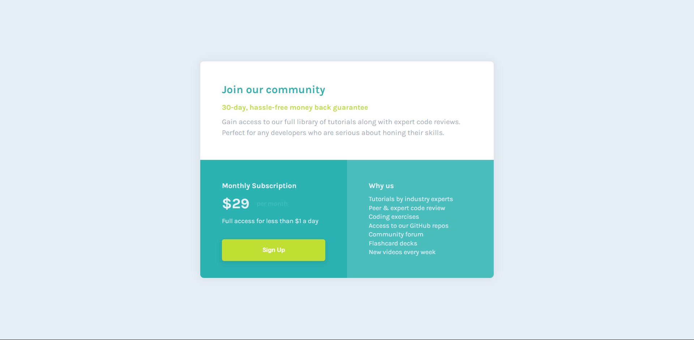

# Single Price Grid Component

Esta es una solución al [desafío del single price grid component en Frontend Mentor](https://www.frontendmentor.io/challenges/single-price-grid-component-5ce41129d0ff452fec5abbbc/hub). Los desafíos de Frontend Mentor lo ayudan a mejorar sus habilidades de codificación mediante la creación de proyectos realistas.

- Solution URL: [Github](https://github.com/ayrtonbolwal/fm-single-price-grid-component)
- Live Site URL: [Netifly](https://ayrtonbolwal-single-price-grid.netlify.app/)

## Mi Proceso

- Semántica de HTML5
- Variables en CSS
- Técnicas de Flexbox
- Convención BEM

## Cosas que aprendí

- Entrega de etapas con Git
- Convención BEM

## Recursos

- [Conveción BEM](https://www.freecodecamp.org/espanol/news/convenciones-de-nomenclatura-de-css-que-te-ahorraran-horas-de-depuracion/)
- [Position absolute](https://developer.mozilla.org/en-US/docs/Web/CSS/position)
- [Agregar archivos al repo](https://docs.github.com/es/repositories/working-with-files/managing-files/adding-a-file-to-a-repository)

Happy Coding! 👾🖖